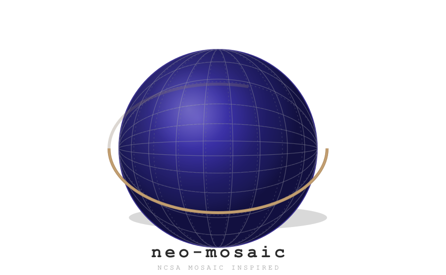

# neo-mosaic

> NCSA Mosaic-inspired retro browser theme for Firefox, Chrome/Chromium, and Opera GX.

Brings back the look and feel of the original NCSA Mosaic web browser — the first graphical browser that brought the web to the masses in 1993. Classic Motif/Windows 3.1 grey chrome with navy link accents.

## Variants

Three visual styles, each available for all supported browsers:

| Variant | Logo | Firefox | Chrome | Opera GX |
|---------|------|---------|--------|----------|
| **diamond** | Geometric diamond tiles (original NCSA Mosaic logo by Colleen Bushell) | `firefox/diamond/` | `chrome/diamond/` | `opera/diamond/` |
| **globe** | Spinning planet Earth throbber (introduced in Mosaic 2.0, November 1993) | `firefox/globe/` | `chrome/globe/` | `opera/globe/` |
| **marble** | Diamond logo on classic 90s web marble/stone texture background | `firefox/marble/` | `chrome/marble/` | `opera/marble/` |

 

## Structure

```
neo-mosaic/
├── firefox/
│   ├── diamond/            # Firefox — diamond variant (WebExtension)
│   │   ├── manifest.json
│   │   ├── mosaic-header.png
│   │   └── icon-*.png
│   ├── globe/              # Firefox — globe variant
│   └── marble/             # Firefox — marble variant
├── chrome/
│   ├── diamond/            # Chrome — diamond variant (Manifest V3)
│   │   ├── manifest.json
│   │   ├── mosaic-header.png
│   │   └── icon-*.png
│   ├── globe/              # Chrome — globe variant
│   └── marble/             # Chrome — marble variant
├── opera/
│   ├── diamond/            # Opera GX — diamond mod
│   │   ├── manifest.json
│   │   ├── icon_512.png
│   │   └── wallpaper/
│   ├── globe/              # Opera GX — globe mod
│   └── marble/             # Opera GX — marble mod
├── shared/                 # SVG/PNG source assets
├── Makefile                # Build all packages
└── README.md
```

## Quick Start

```sh
make              # build all 9 packages (latest unversioned)
make release      # build with version in filename
make clean        # remove all build artifacts
```

### Outputs

| Package | File |
|---------|------|
| Firefox diamond `.xpi` | `neo-mosaic-firefox-diamond.xpi` |
| Firefox globe `.xpi` | `neo-mosaic-firefox-globe.xpi` |
| Firefox marble `.xpi` | `neo-mosaic-firefox-marble.xpi` |
| Chrome diamond `.zip` | `neo-mosaic-chrome-diamond.zip` |
| Chrome globe `.zip` | `neo-mosaic-chrome-globe.zip` |
| Chrome marble `.zip` | `neo-mosaic-chrome-marble.zip` |
| Opera GX diamond mod `.zip` | `neo-mosaic-opera-diamond.zip` |
| Opera GX globe mod `.zip` | `neo-mosaic-opera-globe.zip` |
| Opera GX marble mod `.zip` | `neo-mosaic-opera-marble.zip` |

## Installing

### Firefox

**Development (unsigned, persists per session):**
1. Open `about:debugging#/runtime/this-firefox`
2. Click **Load Temporary Add-on...**
3. Select `firefox/<variant>/manifest.json`

**Permanent (signed via AMO):**
Submit the `.xpi` to [addons.mozilla.org](https://addons.mozilla.org) for signing. After signing, install via `about:addons` → gear icon → **Install Add-on From File...**

### Chrome / Chromium / Brave / Edge

1. Open `chrome://extensions/`
2. Enable **Developer mode**
3. Click **Load unpacked**
4. Select `chrome/<variant>/`

For end-user distribution, upload `chrome/<variant>.zip` to the [Chrome Web Store](https://chrome.google.com/webstore/). Brave and Opera (Chrome theme mode) users can install from there.

### Opera GX (native mod format)

**Development:**
1. Open `opera:extensions`
2. Enable **Developer mode**
3. Click **Load unpacked**
4. Select `opera/<variant>/`

**Packaged mod:**
Use **Pack extension** from `opera:extensions` to create a `.crx`, or use the `.zip` for upload to [GX.store](https://operagx.gg/mods2).

## Color Palette

| Shade | Color | Role |
|-------|-------|------|
| `#C0C0C0` | Motif grey | Window frame, toolbars, sidebars |
| `#D4D4D4` | Light grey | Selected tabs, hover states |
| `#A8A8A8` | Dark grey | Inactive frames |
| `#808080` | Shadow grey | Borders, separators |
| `#FFFFFF` | White | URL/omnibox fields |
| `#000000` | Black | Text |
| `#000080` | Navy | Links, bookmarks, highlights |

Diamond icons and headers use the four Mosaic logo colors: rust `#B84B16`, dark teal `#005953`, yellow-green `#B2BB1E`, and gold `#C5A901`.

## Marble Texture

The marble variant generates a procedural 90s-web stone texture using Perlin/FBM noise with sinusoidal veining — the classic tiled-background look from the Geocities era. Each build regenerates the texture with a deterministic seed.

## License

MIT
